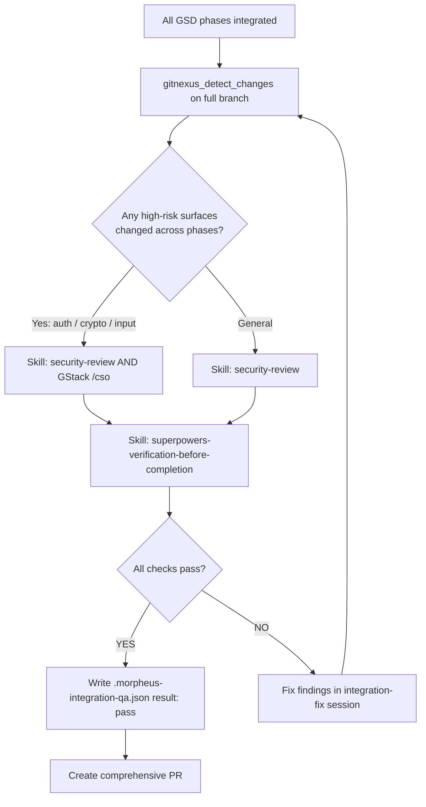

## Purpose

When a bug escalates to GSD (multiple phases, multiple Morpheus sessions), each session runs its own security check (`security_qa` in `.morpheus-qa.json`) against its own narrow diff. Those per-session checks cannot detect vulnerabilities that span phase boundaries — for example, an auth change in Phase 1 combined with an input-validation change in Phase 3.

This gate runs **once**, on the **full combined diff**, after all phases are integrated and before the comprehensive PR is opened.

| Per-session check | Integration gate |
|---|---|
| Sees one phase's narrow diff only | Sees the full combined changeset |
| Records `security_qa` in `.morpheus-qa.json` per session | Records result in `.morpheus-integration-qa.json` |
| Optional — skipped if no auth/security surface changed in that session | **Mandatory — always runs regardless of which surfaces each phase touched** |
| Cannot detect cross-phase vulnerabilities | Can detect vulnerabilities that span phase boundaries |

---

## Required steps — in order, non-skippable

**Step 1 — Confirm the integrated branch**

Verify that all phase branches have been merged into a single integration branch before proceeding.

```bash
git log --oneline origin/main..HEAD | head -20
```

**Step 2 — Run `gitnexus_detect_changes` on the full integrated branch**

```bash
# Call the MCP tool
gitnexus_detect_changes({scope: "integrated-branch"})
```

This maps the complete set of changed symbols and affected processes across all phases. Review the output to understand the full blast radius before running security checks.

**Step 3 — Run the security review on the full combined diff**

Choose the appropriate tool based on what surfaces changed across all phases:

| Condition | Tool to use |
|---|---|
| Any phase touched auth, cryptography, input validation, session handling, or data exposure | `Skill("security-review")` AND `GStack /cso` |
| General vulnerability sweep (no specific high-risk surface) | `Skill("security-review")` |

Invoke with the full integrated branch diff as context — not a per-phase diff.

**Step 4 — Run end-to-end verification on the integrated branch**

```bash
Skill("superpowers-verification-before-completion")
```

This confirms the full test suite is green across the combined changeset, not just within each phase's scope.

**Step 5 — Fix findings if any exist**

If Step 3 or Step 4 returns failures or security findings:
- Fix them in a dedicated integration-fix session.
- Re-run Steps 2–4 after each fix.
- Do **not** open the PR with open findings or failing tests.

**Step 6 — Write `.morpheus-integration-qa.json`**

Write this file at the repo root before PR creation:

```json
{
  "schema_version": "1",
  "phases_completed": ["<phase-id-1>", "<phase-id-2>"],
  "integration_security_qa": {
    "invoked": true,
    "tool": "security-review | GStack /cso",
    "result": "pass | fail",
    "findings": []
  },
  "integration_verification": {
    "invoked": true,
    "result": "pass | fail",
    "suite_total": 0,
    "suite_failed": 0
  }
}
```

**Step 7 — Gate check before PR**

Do **not** create the comprehensive PR until both conditions are met:
- `integration_security_qa.result` is `"pass"`
- `integration_verification.result` is `"pass"`

If either is `"fail"`, return to Step 5.

---

## Integration gate diagram



---

## Non-negotiable rules

- Do **not** skip this gate, even if every individual session passed its own security check.
- Do **not** create the comprehensive PR until `.morpheus-integration-qa.json` exists with both results set to `"pass"`.
- Do **not** use a per-phase diff as a substitute for the full combined diff — the whole point of this gate is cross-phase visibility.
- If `gitnexus_detect_changes` is unavailable (server down), state it explicitly and fall back to `git diff origin/main...HEAD` to enumerate changed files manually before running the security review.
