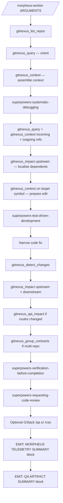

## Summary — order of operations

1. Use **GitNexus first** to orient in the repo, route the investigation, and narrow the blast radius.
2. Use **Superpowers `/systematic-debugging`** to reproduce and identify root cause before changing code.
3. Use **Superpowers `/test-driven-development`** to add or tighten a failing regression test.
4. Implement the **narrowest fix** consistent with the GitNexus graph and the failing test.
5. Run **GitNexus post-fix diagnostics**:
   - `gitnexus_detect_changes`
   - `gitnexus_impact` upstream (who called the changed symbol)
   - `gitnexus_impact` downstream (what this symbol depends on)
   - `gitnexus_api_impact` (if HTTP routes or API surfaces changed)
   - `gitnexus_group_contracts` (if multi-repo groups are configured)
6. Use **Superpowers `/verification-before-completion`** for fresh verification.
7. Use **Superpowers `/requesting-code-review`** for review.
8. Use **GStack `/qa`** only if UI/frontend changed; **GStack `/cso`** only if auth/security surface changed.
9. If the bug escalates to GSD (multi-phase), invoke `Skill("morpheus-integration-gate")` after all phases integrate and before the comprehensive PR.

**Mandatory Superpowers invocations (use `Skill` tool — not inline emulation):**

| When | Skill to invoke |
|---|---|
| Before any code change | `Skill("superpowers-systematic-debugging")` |
| Before writing the fix | `Skill("superpowers-test-driven-development")` |
| After fix + diagnostics | `Skill("superpowers-verification-before-completion")` |
| Before declaring done | `Skill("superpowers-requesting-code-review")` |
| GSD path: after all phases integrate | `Skill("morpheus-integration-gate")` |

If a Superpowers skill is not installed, **stop and report** — do not proceed with the fix until the skill is available or the user explicitly opts out.

---

## Worker preamble contract

Before any source reading, code editing, or test-writing, enforce this contract in order:

**Step 0 — Pre-flight: verify `.mcp.json` has a `gitnexus` entry**

```bash
cat .mcp.json 2>/dev/null | python3 -c "import json,sys; d=json.load(sys.stdin); print('ok' if 'gitnexus' in d.get('mcpServers',{}) else 'missing')" 2>/dev/null || echo "missing"
```

- If the result is `missing`: **STOP immediately.** Print this message and wait for the user to fix it:

  ```
  ✗ GitNexus MCP is not configured in .mcp.json.

  Add this to your .mcp.json (create the file if it does not exist):

  {
    "mcpServers": {
      "gitnexus": {
        "command": "npx",
        "args": ["-y", "gitnexus@latest", "mcp"]
      }
    }
  }

  Then re-run: npx gitnexus analyze
  Then restart Claude Code so the MCP server is approved and connected.
  Then re-invoke this skill.
  ```

- If the result is `ok`: continue to step 1.

**Do not proceed to degraded mode when the fix is a missing config file.** Degraded mode is only for when `.mcp.json` is correct but the server is transiently unavailable.

**Step 0.5 — Create fix branch (never work on main or master)**

```bash
CURRENT_BRANCH=$(git rev-parse --abbrev-ref HEAD)
DEFAULT_BRANCH=$(git symbolic-ref refs/remotes/origin/HEAD 2>/dev/null | sed 's|refs/remotes/origin/||' || echo "main")
```

| Current branch | Action |
|---|---|
| `main` or `master` or matches `$DEFAULT_BRANCH` | Create and switch: `git checkout -b fix/<issue-id>` |
| Already on `fix/…` or any non-default branch | Continue — branch already exists (orchestrator worktree path) |

Branch naming rules:
- Known issue ID (e.g. `JIRA-101`, `KAN-229`): use `fix/JIRA-101`
- Plain-language summary or stack trace: slugify the first 5 words → `fix/mfa-login-500-post-auth`
- Always lowercase, hyphens only, no spaces or special characters

```bash
# Example: create and push branch
git checkout -b fix/<issue-id>
git push -u origin fix/<issue-id>
```

**Do not make any code changes — including writing test files — while on `main`, `master`, or the default branch. Stop and create the branch first.**

1. Call `gitnexus_list_repos()` — verify the index is non-empty. If empty, run `npx gitnexus analyze` and re-check before continuing.
2. Call `gitnexus_query({query: "<bug summary>"})` — broad orientation, find candidate symbols.
3. Call `gitnexus_context({name: "<top candidate>"})` — assemble relevant context bundle.
4. Use GitNexus tools to localise the likely root-cause area.
5. Before editing each target file, call `gitnexus_context` on the target symbol.
6. Prefer `gitnexus_query` + `gitnexus_context` over whole-file reads.
7. Only fall back to `Read`, `Grep`, or `Glob` when `.mcp.json` is correct but the server is transiently unavailable.

---

## Primary tools

### GitNexus MCP tools (use in this order)

- `gitnexus_list_repos` — orient: verify index is non-empty
- `gitnexus_query` — hybrid BM25 + semantic search; replaces `search_symbols` and `get_repo_outline`
- `gitnexus_context` — 360-degree symbol view (callers + callees + process participation)
- `gitnexus_impact` with `direction: "upstream"` — who depends on this symbol
- `gitnexus_impact` with `direction: "downstream"` — what this symbol depends on
- `gitnexus_detect_changes` — git-diff impact; maps changed lines to affected processes
- `gitnexus_api_impact` — blast radius for HTTP route or API surface changes
- `gitnexus_rename` — coordinated multi-file rename
- `gitnexus_group_contracts` — cross-repo contract check
- `gitnexus_cypher` — raw Cypher graph query for complex multi-hop traces

### Superpowers skills

- `/systematic-debugging`
- `/test-driven-development`
- `/verification-before-completion`
- `/requesting-code-review`

### Optional GStack

- `/qa` — browser/UI validation (only if UI changed)
- `/cso` — security audit (only if auth/security surface changed)

### Fallback rule

If a **GitNexus MCP tool** is unavailable (server transiently down, not config missing):
- continue in degraded mode using `Read` / `Grep` / `Glob`
- state explicitly that GitNexus is unavailable

If a **Superpowers skill** is unavailable:
- **stop** — do not emulate inline
- tell the user which skill is missing and ask them to install it or explicitly opt out

---

## Main fix loop

| Stage | Required action | Output needed before continuing |
|---|---|---|
| Orient | `gitnexus_list_repos()` | non-empty index confirmed |
| Assemble context | `gitnexus_query({query: "<bug area>"})` | candidate symbols |
| Reproduce | `Skill("superpowers-systematic-debugging")` | exact bug reproduction or smallest failing case |
| Localise | `gitnexus_query`, `gitnexus_context` (incoming + outgoing refs), `gitnexus_impact(upstream)` | root-cause candidate with evidence |
| Prepare edit | `gitnexus_context({name: "<target symbol>"})` | callers, deps, process participation |
| Lock regression | `Skill("superpowers-test-driven-development")` | failing regression test + `suite_before_fix` captured in `.morpheus-qa.json` |
| Fix | narrow code change only | test now passes locally; `tests_modified` updated in `.morpheus-qa.json` |
| Diagnose change | `gitnexus_detect_changes({scope: "staged"})` | changed symbols + affected processes |
| Verify impact | `gitnexus_impact(upstream)` + `gitnexus_impact(downstream)` | blast radius confirmed |
| API check | `gitnexus_api_impact` (if routes changed) | route consumers identified |
| Contract check | `gitnexus_group_contracts` (if multi-repo) | cross-repo breakage ruled out |
| Verify | `Skill("superpowers-verification-before-completion")` | fresh green evidence + `suite_after_fix` + coverage + **JT-SCI score** captured in `.morpheus-qa.json` |
| Review | `Skill("superpowers-requesting-code-review")` | review findings + **QA test cases + `qa_score`** written to `.morpheus-qa.json` |
| **Human gate — PR method** | Pause and ask human: auto PR or manual PR | Human choice confirmed before proceeding |
| Create PR | auto: `gh pr create`; manual: print branch + SHA | PR URL confirmed or instructions printed |
| **Emit summaries** | **MANDATORY** | print MORPHEUS TELEMETRY SUMMARY block, then QA ARTIFACT SUMMARY block |

**QA artifact checkpoints** — update `.morpheus-qa.json` at these specific stages:

| Stage | What to write |
|---|---|
| Lock regression | `regression_test` (file, name, framework), `tests_added` list, `suite_before_fix` (total/pass/fail/skip) |
| Fix | `tests_modified` list (any existing tests tightened) |
| Verify | `suite_after_fix` (total/pass/fail/skip/duration), `coverage` delta if tool available |
| Review | `ui_qa` result (invoked or skipped + reason), `security_qa` result (invoked or skipped + reason) |

### PR creation

#### Step 1 — Commit and push the fix branch

Before asking the human, commit all changes and push the branch. This is always done regardless of which PR path the human chooses.

```bash
# Stage only fix-related changes (never use git add -A)
git add -p

git commit -m "fix(<issue-id>): <one-line summary>

- Root cause: <what was broken>
- Fix: <what changed>
- Regression test: <test file and name>

Fixes <issue-id>"

DEFAULT_BRANCH=$(git symbolic-ref refs/remotes/origin/HEAD 2>/dev/null | sed 's|refs/remotes/origin/||' || echo "main")
git push -u origin fix/<issue-id>
```

#### Step 2 — Human gate: ask how to proceed with the PR

**After pushing, pause and ask the human before creating the PR.** Use `AskUserQuestion` with these two options:

```
Question: "Fix branch `fix/<issue-id>` is pushed. How would you like to create the PR?"

Option A — Auto PR (Recommended)
  Claude runs `gh pr create` now. The PR will target `<DEFAULT_BRANCH>` with
  a pre-filled title, description, and verification checklist.

Option B — Manual PR
  Claude prints the branch name, commit SHA, and a pre-filled PR body.
  You open the PR yourself in GitHub / GitLab / Bitbucket.
```

Wait for the human's response before proceeding. Do **not** auto-create the PR if the human has not answered.

#### Step 3A — Auto PR path

If the human chose **Auto PR**:

```bash
gh pr create \
  --title "fix(<issue-id>): <one-line bug summary>" \
  --base "$DEFAULT_BRANCH" \
  --head "fix/<issue-id>" \
  --body "$(cat <<'EOF'
## Bug
<!-- issue-id and one-line summary -->

## Root cause
<!-- what was broken and why -->

## Fix
<!-- what changed, kept as narrow as possible -->

## Verification
- [ ] Regression test added: `<test file>::<test name>`
- [ ] `gitnexus_detect_changes` run
- [ ] `gitnexus_impact` upstream + downstream run
- [ ] `gitnexus_api_impact` run (if routes changed)
- [ ] `superpowers-verification-before-completion` passed
- [ ] `superpowers-requesting-code-review` passed
- [ ] UI QA (`GStack /qa`): invoked / skipped — <reason>
- [ ] Security QA (`GStack /cso`): invoked / skipped — <reason>

## Test suite delta
| | Before | After | Delta |
|---|---|---|---|
| Total | - | - | - |
| Passed | - | - | - |
| Failed | - | - | - |
| Coverage | - | - | - |

## Engineer QA checklist
<!-- Generated from .morpheus-qa.json qa_test_cases — reviewers: please verify each before approving -->

| ID | Test case | Type | How to test |
|---|---|---|---|
| TC-001 | <regression scenario> | regression | Automated — run `<test file>::<test name>` |
| TC-002 | <happy path scenario> | happy_path | Manual — <steps> |
| TC-003 | <edge case scenario> | edge_case | Manual — <steps> |
| TC-004 | <edge case scenario> | edge_case | Manual — <steps> |
| TC-005 | <integration scenario> | integration | Manual — <steps> |

**QA Score: <score>/1.00 — Grade: <A/B/C/D>**

## JT-SCI accuracy score
<!-- JIRA Ticket Specificity & Clarity Index: measures localisation quality, reproduction readiness, structural completeness -->

| Dimension | Score | Notes |
|---|---|---|
| Lq — Localization quality | <n>/3 | <how root cause was found> |
| Re — Reproduction readiness | <n>/3 | <test added? manual repro?> |
| Sc — Structural completeness | <0.0–1.0> | <what components were present> |
| Ps — Semantic penalty | <0.0–1.0> | <deductions if any> |
| **JT-SCI total** | **<score>** | **Grade: <A/B/C/D>** |

> Formula: JT-SCI = 0.40(Lq/3) + 0.40(Re/3) + 0.20·Sc − 0.10·Ps

Fixed by morpheus-fix-bug-using-gitnexus
EOF
)"
```

After `gh pr create` completes, print the PR URL to the session output and record it in `.morpheus-telemetry.json` under `pr_url`.

If `gh` is not installed or returns an error, automatically fall back to the Manual PR path and tell the human.

#### Step 3B — Manual PR path

If the human chose **Manual PR**, print this block and wait — do not proceed further until the human confirms they have opened the PR:

```
┌─────────────────────────────────────────────────────────────┐
│  MANUAL PR INSTRUCTIONS                                     │
├─────────────────────────────────────────────────────────────┤
│  Branch:        fix/<issue-id>                              │
│  Base branch:   <DEFAULT_BRANCH>                            │
│  Commit SHA:    <git rev-parse HEAD>                        │
│  Compare URL:   <remote-url>/compare/<DEFAULT_BRANCH>...fix/<issue-id> │
├─────────────────────────────────────────────────────────────┤
│  Suggested PR title:                                        │
│    fix(<issue-id>): <one-line bug summary>                  │
├─────────────────────────────────────────────────────────────┤
│  Suggested PR body:                                         │
│                                                             │
│  ## Bug                                                     │
│  <issue-id>: <summary>                                      │
│                                                             │
│  ## Root cause                                              │
│  <what was broken>                                          │
│                                                             │
│  ## Fix                                                     │
│  <what changed>                                             │
│                                                             │
│  ## Verification                                            │
│  - [ ] Regression test added: <file>::<name>                │
│  - [ ] gitnexus_detect_changes run                          │
│  - [ ] gitnexus_impact upstream + downstream run            │
│  - [ ] superpowers-verification-before-completion passed    │
│  - [ ] superpowers-requesting-code-review passed            │
│  - [ ] UI QA: invoked / skipped — <reason>                  │
│  - [ ] Security QA: invoked / skipped — <reason>            │
│                                                             │
│  Fixed by morpheus-fix-bug-using-gitnexus                   │
└─────────────────────────────────────────────────────────────┘

Please open the PR and paste the URL here so it can be recorded.
```

Once the human pastes the PR URL, record it in `.morpheus-telemetry.json` under `pr_url` and continue to Emit summaries.

**PR rules (apply to both paths):**
- `--base` is always the repo's default branch — detected dynamically, never hardcoded
- `--head` is always `fix/<issue-id>` — never `main` or `master`
- Do **not** merge the branch directly — the PR is the merge gate
- Do **not** skip the human gate, even in headless mode — if running headless and the human cannot respond, default to Auto PR and log it

### Workflow diagram



---

## Hooks

Assume the preferred state is that `npx gitnexus analyze` has already registered repo-local hooks for:

- `PreToolUse` (denies raw `Read`/`Grep`/`Glob` on indexed source)
- `PreCompact`
- `Stop`

Required behaviour even if the hooks are missing:
- self-enforce the read/grep rule
- self-enforce post-fix diagnostics
- self-enforce stop gating before claiming completion

Optional stop-gate policy — refuse to stop if:
- there is no reproduction
- there is no failing or formerly failing test
- post-fix GitNexus diagnostics have not run
- verification has not been run fresh
- review has not been requested
- or a required worktree hand-off is missing

---

## Telemetry

### What is tracked

| Dimension | What | How |
|---|---|---|
| **Wall-clock time** | Duration of each stage in milliseconds | `date +%s%3N` at start and end of each stage |
| **Token consumption** | Input, output, and cache tokens per stage | Parsed from `--output-format stream-json` in headless mode; self-reported JSON markers in interactive mode |
| **OTEL spans** | One root span per bug, one child span per stage | `otel-cli span create` — requires `otel-cli` to be installed |

### Timing

At the **start of each stage**, record the stage name and millisecond epoch:

```bash
STAGE_NAME="orient"
STAGE_START_MS=$(date +%s%3N)
```

At the **end of each stage**, compute duration and write to the telemetry state file:

```bash
STAGE_END_MS=$(date +%s%3N)
STAGE_DURATION_MS=$((STAGE_END_MS - STAGE_START_MS))
jq --arg stage "$STAGE_NAME" \
   --argjson start "$STAGE_START_MS" \
   --argjson end "$STAGE_END_MS" \
   --argjson dur  "$STAGE_DURATION_MS" \
   '.stages[$stage] |= . + {start_ms: $start, end_ms: $end, duration_ms: $dur}' \
   .morpheus-telemetry.json > .morpheus-telemetry.tmp.json \
   && mv .morpheus-telemetry.tmp.json .morpheus-telemetry.json
```

Apply this pattern to every stage: **Orient, Assemble context, Reproduce, Localise, Prepare edit, Lock regression, Fix, Diagnose change, Verify impact, API check, Contract check, Verify, Review**.

### Token tracking

**Headless mode** — run with `--output-format stream-json`:

```bash
claude --output-format stream-json -p '/morpheus-fix-bug-using-gitnexus KAN-229' \
  | tee session-raw.ndjson
```

Each `usage` event:

```json
{
  "type": "usage",
  "input_tokens": 12400,
  "output_tokens": 2100,
  "cache_read_input_tokens": 9800,
  "cache_creation_input_tokens": 600
}
```

Accumulate delta usage across events to attribute tokens to the active stage. Store per-stage sums in `.morpheus-telemetry.json`.

**Interactive mode** — after each stage, emit:

```json
{"morpheus_telemetry": true, "stage": "<stage-name>", "tokens": {"input": 0, "output": 0, "cache_read": 0, "cache_write": 0}}
```

### OpenTelemetry

Check availability at session start:

```bash
OTEL_ENABLED=$(which otel-cli >/dev/null 2>&1 && echo "true" || echo "false")
```

Configure the exporter:

```bash
export OTEL_EXPORTER_OTLP_ENDPOINT="${OTEL_EXPORTER_OTLP_ENDPOINT:-http://localhost:4317}"
export OTEL_SERVICE_NAME="morpheus-bug-fixer"
```

Root span at session start:

```bash
TRACEPARENT_FILE=".morpheus-traceparent"
if [ "$OTEL_ENABLED" = "true" ]; then
  otel-cli span background \
    --service "morpheus-bug-fixer" \
    --name "bug-fix/<issue-id>" \
    --attrs "bug.id=<issue-id>,bug.source=<jira|cli|stack_trace|test|text>,git.branch=$(git rev-parse --abbrev-ref HEAD)" \
    --tp-print \
    --tp-carrier "$TRACEPARENT_FILE"
fi
```

Per-stage child span:

```bash
if [ "$OTEL_ENABLED" = "true" ]; then
  otel-cli span create \
    --service "morpheus-bug-fixer" \
    --name "stage/$STAGE_NAME" \
    --tp-required \
    --tp-carrier "$TRACEPARENT_FILE" \
    --attrs "stage.duration_ms=$STAGE_DURATION_MS,stage.tokens_in=$TOKENS_IN,stage.tokens_out=$TOKENS_OUT,stage.cache_read=$TOKENS_CACHE_READ,stage.cache_write=$TOKENS_CACHE_WRITE"
fi
```

**Span attribute conventions:**

| Attribute | Value |
|---|---|
| `bug.id` | Jira/GitHub issue key |
| `bug.source` | `jira`, `cli`, `stack_trace`, `test`, `text` |
| `stage.name` | stage name from the fix loop |
| `stage.duration_ms` | integer milliseconds |
| `stage.tokens_in` | input tokens for this stage |
| `stage.tokens_out` | output tokens for this stage |
| `stage.cache_read` | cache-read tokens for this stage |
| `stage.cache_write` | cache-write tokens for this stage |
| `fix.result` | `fixed`, `failed`, `blocked`, `skipped` |
| `git.branch` | current branch |
| `gitnexus.repos_indexed` | repo count from `gitnexus_list_repos` |

If `otel-cli` is not installed, skip span creation silently.

### Telemetry state file

Initialise `.morpheus-telemetry.json` at session start:

```json
{
  "schema_version": "1",
  "bug_id": "<issue-id>",
  "trace_id": null,
  "session_start_ms": 0,
  "pr_url": null,
  "stages": {},
  "totals": {}
}
```

### Telemetry summary block

**Before printing, read `.morpheus-telemetry.json` and extract actual values.** Do NOT copy the example numbers below — they are format examples only. Every value in the printed block must come from the state file written during this session.

Extract values with:

```bash
# Read the state file
TELEMETRY=$(cat .morpheus-telemetry.json)

# Per stage — for each stage name, extract duration and tokens
jq -r '.stages | to_entries[] | "\(.key) \(.value.duration_ms) \(.value.tokens_in // 0) \(.value.tokens_out // 0) \(.value.tokens_cache_read // 0)"' \
   .morpheus-telemetry.json

# Totals
jq '.totals' .morpheus-telemetry.json

# OTEL trace ID (null if not configured)
jq -r '.trace_id // "not configured"' .morpheus-telemetry.json
```

Then print this block with the **actual extracted values** substituted in:

```
╔════════════════════════════════════════════════════════════════════════════╗
║         MORPHEUS TELEMETRY SUMMARY — <bug_id from .morpheus-telemetry.json>  ║
╠═══════════════════════╦══════════════╦═══════════════════════════════════╣
║ Stage                 ║ Duration     ║ Tokens (in / out / cache)         ║
╠═══════════════════════╬══════════════╬═══════════════════════════════════╣
║ Orient                ║  <actual>    ║   <actual> / <actual> / <actual>  ║
║ Assemble context      ║  <actual>    ║   <actual> / <actual> / <actual>  ║
║ Reproduce             ║  <actual>    ║   <actual> / <actual> / <actual>  ║
║ Localise              ║  <actual>    ║   <actual> / <actual> / <actual>  ║
║ Prepare edit          ║  <actual>    ║   <actual> / <actual> / <actual>  ║
║ Lock regression       ║  <actual>    ║   <actual> / <actual> / <actual>  ║
║ Fix                   ║  <actual>    ║   <actual> / <actual> / <actual>  ║
║ Diagnose change       ║  <actual>    ║   <actual> / <actual> / <actual>  ║
║ Verify impact         ║  <actual>    ║   <actual> / <actual> / <actual>  ║
║ API check             ║  <actual>    ║   <actual> / <actual> / <actual>  ║
║ Contract check        ║  <actual>    ║   <actual> / <actual> / <actual>  ║
║ Verify                ║  <actual>    ║   <actual> / <actual> / <actual>  ║
║ Review                ║  <actual>    ║   <actual> / <actual> / <actual>  ║
╠═══════════════════════╬══════════════╬═══════════════════════════════════╣
║ TOTAL                 ║  <sum ms>    ║  <sum_in> / <sum_out> / <sum_cache> ║
║                       ║  (<Xm Ys>)   ║  Combined total: <grand_total>    ║
╠═══════════════════════╩══════════════╩═══════════════════════════════════╣
║ OTEL Trace ID: <trace_id or "not configured">                            ║
║ Trace URL:     <url or omit row if not configured>                       ║
╚════════════════════════════════════════════════════════════════════════════╝
```

**Rules for filling the block:**
- If a stage was skipped (e.g. API check when no routes changed), print `—` in Duration and Tokens.
- If a stage has no token data (interactive mode without JSON markers), print `n/a` in Tokens.
- Duration: print in ms for < 10,000 ms; convert to `Xm Ys` format for ≥ 10,000 ms.
- Omit the OTEL rows entirely if `trace_id` is null.
- If `.morpheus-telemetry.json` does not exist or is empty, print `⚠ telemetry state file missing — timing data not available` and continue.

**Example of what the filled block looks like** (illustrative only — not real values):

```
╔════════════════════════════════════════════════════════════════════════════╗
║               MORPHEUS TELEMETRY SUMMARY — JIRA-101                       ║
╠═══════════════════════╦══════════════╦═══════════════════════════════════╣
║ Stage                 ║ Duration     ║ Tokens (in / out / cache)         ║
╠═══════════════════════╬══════════════╬═══════════════════════════════════╣
║ Orient                ║  1,234 ms    ║   2,100 /   340 /  1,500          ║
║ Assemble context      ║  2,890 ms    ║   5,400 /   620 /  4,200          ║
║ Reproduce             ║ 45,210 ms    ║  18,200 / 3,400 / 12,100          ║
║ Localise              ║  8,320 ms    ║   7,800 / 1,200 /  6,400          ║
║ Prepare edit          ║  3,100 ms    ║   4,200 /   580 /  3,800          ║
║ Lock regression       ║ 32,450 ms    ║  14,300 / 2,800 / 11,200          ║
║ Fix                   ║  6,780 ms    ║   3,400 /   920 /  2,800          ║
║ Diagnose change       ║  2,100 ms    ║   2,800 /   440 /  2,400          ║
║ Verify impact         ║  4,560 ms    ║   4,100 /   680 /  3,600          ║
║ API check             ║      —       ║   —                               ║
║ Contract check        ║      —       ║   —                               ║
║ Verify                ║ 28,340 ms    ║  12,400 / 2,100 /  9,800          ║
║ Review                ║ 19,670 ms    ║   9,600 / 1,800 /  7,200          ║
╠═══════════════════════╬══════════════╬═══════════════════════════════════╣
║ TOTAL                 ║ 124,754 ms   ║  79,400 / 14,880 / 57,400         ║
║                       ║  (2m 4s)     ║  Combined total: 151,680 tokens   ║
╚════════════════════════════════════════════════════════════════════════════╝
```

---

## QA Artifacts

### QA state file

Initialise `.morpheus-qa.json` at session start:

```json
{
  "schema_version": "2",
  "bug_id": "<issue-id>",
  "regression_test": null,
  "tests_added": [],
  "tests_modified": [],
  "suite_before_fix": null,
  "suite_after_fix": null,
  "coverage": null,
  "ui_qa": null,
  "security_qa": null,
  "qa_test_cases": [],
  "qa_score": null,
  "jtsci": null
}
```

### Recording at each QA stage

#### At "Lock regression" (`superpowers-test-driven-development`)

```bash
jq '.regression_test = {
      "file": "tests/auth/test_login.py",
      "test_name": "test_mfa_login_500_regression",
      "framework": "pytest",
      "was_failing_before_fix": true
    } |
    .tests_added = [{
      "file": "tests/auth/test_login.py",
      "test_name": "test_mfa_login_500_regression",
      "type": "regression"
    }]' .morpheus-qa.json > .morpheus-qa.tmp.json && mv .morpheus-qa.tmp.json .morpheus-qa.json

# Run full suite and capture baseline (adapt to project's test runner):
# Python: pytest --tb=no -q 2>&1 | tail -1
# JS/TS:  npx jest --passWithNoTests --json 2>/dev/null | jq '{total:.numTotalTests,...}'
# Go:     go test ./... -v 2>&1 | grep -E "^(ok|FAIL|---)"
# Java:   mvn test -q 2>&1 | grep -E "Tests run:"
# C#:     dotnet test --no-build 2>&1

jq '.suite_before_fix = {"total": 0, "passed": 0, "failed": 0, "skipped": 0, "duration_ms": 0, "command": "<test command>"}' \
   .morpheus-qa.json > .morpheus-qa.tmp.json && mv .morpheus-qa.tmp.json .morpheus-qa.json
```

**Do not proceed to the Fix stage if `suite_before_fix` is null.**

#### At "Fix" (after narrow code change)

```bash
jq '.tests_modified = [{"file": "<path>", "test_name": "<name>", "change": "<why it changed>"}]' \
   .morpheus-qa.json > .morpheus-qa.tmp.json && mv .morpheus-qa.tmp.json .morpheus-qa.json
```

If no existing tests changed, leave `tests_modified` as `[]`.

#### At "Verify" (`superpowers-verification-before-completion`)

```bash
jq '.suite_after_fix = {"total": 0, "passed": 0, "failed": 0, "skipped": 0, "duration_ms": 0}' \
   .morpheus-qa.json > .morpheus-qa.tmp.json && mv .morpheus-qa.tmp.json .morpheus-qa.json

# Coverage delta (adapt to tooling):
# Python:  pytest --cov=. --cov-report=json -q
# JS:      npx jest --coverage --coverageReporters=json-summary
# Go:      go test ./... -coverprofile=coverage.out && go tool cover -func=coverage.out
# C#:      dotnet test --collect:"XPlat Code Coverage"

jq --arg before "0" --arg after "$AFTER_PCT" \
   '.coverage = {"before_pct": ($before | tonumber), "after_pct": ($after | tonumber),
                 "delta_pct": (($after | tonumber) - ($before | tonumber))}' \
   .morpheus-qa.json > .morpheus-qa.tmp.json && mv .morpheus-qa.tmp.json .morpheus-qa.json
```

#### After GStack `/qa` (UI QA — optional, only if UI changed)

```bash
jq '.ui_qa = {
      "invoked": true,
      "result": "pass",
      "scenarios_tested": ["<scenario 1>"],
      "screenshots": ["qa/screenshots/<name>.png"]
    }' .morpheus-qa.json > .morpheus-qa.tmp.json && mv .morpheus-qa.tmp.json .morpheus-qa.json
# If not invoked: {"invoked": false, "reason": "no UI changes in this fix"}
```

#### After GStack `/cso` (security review — optional, only if auth/security surface changed)

```bash
jq '.security_qa = {"invoked": true, "result": "pass", "findings": []}' \
   .morpheus-qa.json > .morpheus-qa.tmp.json && mv .morpheus-qa.tmp.json .morpheus-qa.json
# If not invoked: {"invoked": false, "reason": "no auth/security surface changed"}
```

#### At "Review" — Generate QA test cases for engineers

After `superpowers-requesting-code-review` completes, generate a test case checklist engineers can use to verify the fix in review. Write it to `qa_test_cases` and compute `qa_score`.

**How to generate test cases:**
- **TC-001 (regression)**: Always present — the failing test that was added. Maps directly to `regression_test`.
- **TC-002 (happy path)**: The primary user flow that the fix should not have broken. Derived from `gitnexus_impact` downstream consumers.
- **TC-003+ (edge cases)**: 2–4 edge cases specific to the fix area. Derived from `gitnexus_context` callees and the root cause analysis.
- **TC-integration**: One test per upstream caller identified in `gitnexus_impact(upstream)` — verify they still behave correctly.

Each test case must have: `automated` (true if a test file covers it), `test_file` (path if automated), `steps` (for manual cases), and `expected_result`.

```bash
jq '.qa_test_cases = [
  {
    "id": "TC-001",
    "title": "Regression: <original bug scenario>",
    "type": "regression",
    "automated": true,
    "test_file": "<regression test file>::<test name>",
    "steps": [],
    "expected_result": "Test passes — original bug does not recur"
  },
  {
    "id": "TC-002",
    "title": "Happy path: <primary flow>",
    "type": "happy_path",
    "automated": false,
    "test_file": null,
    "steps": ["<step 1>", "<step 2>"],
    "expected_result": "<expected behaviour>"
  },
  {
    "id": "TC-003",
    "title": "Edge case: <scenario>",
    "type": "edge_case",
    "automated": false,
    "test_file": null,
    "steps": ["<step 1>"],
    "expected_result": "<expected behaviour>"
  }
]' .morpheus-qa.json > .morpheus-qa.tmp.json && mv .morpheus-qa.tmp.json .morpheus-qa.json
```

Then compute `qa_score` (0.0–1.0):

| Component | Points | Condition |
|---|---|---|
| Regression test present and automated | 0.30 | `regression_test` non-null and `automated: true` |
| At least one happy-path test case | 0.20 | `qa_test_cases` has type `happy_path` |
| At least two edge-case test cases | 0.20 | `qa_test_cases` has ≥ 2 type `edge_case` |
| All failing tests reach zero | 0.20 | `suite_after_fix.failed == 0` |
| Coverage delta ≥ 0 | 0.10 | `coverage.delta_pct >= 0` (or coverage null = 0.05) |

```bash
jq '.qa_score = {
      "total_test_cases": (<count of qa_test_cases>),
      "automated_count": (<count where automated=true>),
      "manual_count": (<count where automated=false>),
      "regression_covered": true,
      "happy_path_covered": true,
      "edge_cases_count": 2,
      "score": 0.90,
      "grade": "A"
    }' .morpheus-qa.json > .morpheus-qa.tmp.json && mv .morpheus-qa.tmp.json .morpheus-qa.json
```

Grade scale: A ≥ 0.85 | B ≥ 0.70 | C ≥ 0.55 | D < 0.55

#### After Verify — Compute JT-SCI score

The **JIRA Ticket Specificity & Clarity Index (JT-SCI)** is a post-fix accuracy metric. It measures how well-localised, reproducible, structurally complete, and semantically clear the fix is. Score is bounded 0.0–1.0.

**Formula:**

```
JT-SCI(T) = α(Lq/3) + β(Re/3) + γSc − λPs
```

**Default weights:** α = 0.40, β = 0.40, γ = 0.20, λ = 0.10

**Scoring rubric — evaluate honestly based on what actually happened in this session:**

| Dimension | Score | Criteria |
|---|---|---|
| **Lq** — Localization Quality (0–3) | 3 | Used `gitnexus_context` on exact symbol; fix landed in that symbol |
| | 2 | Used `gitnexus_query`; fix landed in the identified area |
| | 1 | Used file-level search or manual navigation |
| | 0 | Fix was speculative; root cause not confirmed before patching |
| **Re** — Reproduction Readiness (0–3) | 3 | Failing regression test written + manual repro confirmed |
| | 2 | Failing regression test written only |
| | 1 | Manual repro steps only, no automated test |
| | 0 | No reproduction established before fixing |
| **Sc** — Structural Completeness (0.0–1.0) | +0.25 | Root cause clearly identified and documented |
| | +0.25 | Regression test added and in `tests_added` |
| | +0.25 | Post-fix GitNexus diagnostics all run |
| | +0.25 | `superpowers-verification-before-completion` passed |
| **Ps** — Semantic Penalty (0.0–1.0) | +0.30 | Fix scope is unclear or touches unrelated code |
| | +0.30 | Root cause description is vague or missing |
| | +0.20 | Test coverage gaps exist in the changed area |
| | +0.20 | No clear evidence chain from symptom to root cause |

Compute and write to `.morpheus-qa.json`:

```bash
# Example: Lq=3, Re=2, Sc=0.75, Ps=0.10, using default weights
# JT-SCI = 0.40*(3/3) + 0.40*(2/3) + 0.20*0.75 - 0.10*0.10
#        = 0.400 + 0.267 + 0.150 - 0.010 = 0.807

jq '.jtsci = {
      "formula": "α(Lq/3) + β(Re/3) + γSc − λPs",
      "weights": {"alpha": 0.40, "beta": 0.40, "gamma": 0.20, "lambda": 0.10},
      "scores": {
        "Lq": 3,
        "Re": 2,
        "Sc": 0.75,
        "Ps": 0.10
      },
      "components": {
        "localization":    0.400,
        "reproduction":    0.267,
        "completeness":    0.150,
        "penalty":        -0.010
      },
      "jtsci_score": 0.807,
      "grade": "B",
      "interpretation": "Well-localised fix with automated regression test; minor completeness gap."
    }' .morpheus-qa.json > .morpheus-qa.tmp.json && mv .morpheus-qa.tmp.json .morpheus-qa.json
```

JT-SCI grade scale: A ≥ 0.85 | B ≥ 0.70 | C ≥ 0.55 | D < 0.55

**A JT-SCI score below 0.55 (grade D) must be flagged in the PR body.** It indicates the fix carries localization or reproduction risk and needs closer review.

### QA summary block

**Before printing, read `.morpheus-qa.json` and extract actual values.** Do NOT copy the example numbers — they are format examples only. Every value must come from the state file written during this session.

Extract values with:

```bash
cat .morpheus-qa.json | jq '{
  bug_id,
  regression_test,
  tests_added_count: (.tests_added | length),
  tests_modified_count: (.tests_modified | length),
  suite_before_fix,
  suite_after_fix,
  coverage,
  ui_qa,
  security_qa,
  qa_test_cases,
  qa_score,
  jtsci
}'
```

Then print this block with **actual extracted values** substituted in. The block below is an example of the format only:

```
╔══════════════════════════════════════════════════════════════════════╗
║        QA ARTIFACT SUMMARY — <bug_id from .morpheus-qa.json>        ║
╠══════════════════════════════════════════════════════════════════════╣
║ Regression test                                                      ║
║   File:       tests/auth/test_login.py                              ║
║   Test name:  test_mfa_login_500_regression                         ║
║   Framework:  pytest                                                 ║
╠═══════════════════════╦════════════════════════════════════════════╣
║ Test cases (new)       ║ Added: 1   Modified: 0   Deleted: 0       ║
╠═══════════╦════════════╬══════════════════╦══════════════════════════╣
║ Suite     ║ Before fix ║ After fix        ║ Delta                   ║
╠═══════════╬════════════╬══════════════════╬══════════════════════════╣
║ Total     ║ 142        ║ 143              ║ +1                      ║
║ Passed    ║ 141        ║ 143              ║ +2                      ║
║ Failed    ║   1        ║   0              ║ -1  ✓                   ║
║ Skipped   ║   2        ║   2              ║  0                      ║
║ Duration  ║ 14.2 s     ║ 14.8 s           ║ +0.6 s                  ║
╠═══════════╬════════════╬══════════════════╬══════════════════════════╣
║ Coverage  ║ 78.4%      ║ 79.1%            ║ +0.7%                   ║
╠═══════════╩════════════╩══════════════════╩══════════════════════════╣
║ UI QA:       not invoked — no UI changes in this fix                ║
║ Security QA: not invoked — no auth surface changes                  ║
╠══════════════════════════════════════════════════════════════════════╣
║ ENGINEER QA TEST CASES (5 total — 2 automated, 3 manual)           ║
╠════╦═══════════════════════════════════╦══════════╦══════════════════╣
║ ID ║ Title                             ║ Type     ║ Automated        ║
╠════╬═══════════════════════════════════╬══════════╬══════════════════╣
║ TC-001 ║ Regression: MFA login 500   ║ regression  ║ YES — pytest  ║
║ TC-002 ║ Happy path: normal login    ║ happy_path  ║ NO — manual   ║
║ TC-003 ║ Edge: MFA disabled user     ║ edge_case   ║ NO — manual   ║
║ TC-004 ║ Edge: expired MFA token     ║ edge_case   ║ NO — manual   ║
║ TC-005 ║ Integration: /auth/refresh  ║ integration ║ NO — manual   ║
╠════╩═══════════════════════════════════╩══════════╩══════════════════╣
║ QA Score: 0.90  Grade: A   (automated: 2/5, coverage delta: +0.7%) ║
╠══════════════════════════════════════════════════════════════════════╣
║ JT-SCI SCORE                                                        ║
║   Lq (Localization):   3/3  — exact symbol via gitnexus_context    ║
║   Re (Reproduction):   2/3  — failing test added, no manual repro  ║
║   Sc (Completeness):  0.75  — root cause + test + diagnostics      ║
║   Ps (Penalty):       0.10  — minor: no manual repro steps         ║
║   ─────────────────────────────────────────────────────────        ║
║   JT-SCI = 0.40(3/3) + 0.40(2/3) + 0.20(0.75) − 0.10(0.10)      ║
║           = 0.400 + 0.267 + 0.150 − 0.010 = 0.807   Grade: B     ║
╚══════════════════════════════════════════════════════════════════════╝
```

Rendering rules:
- If `suite_before_fix` is null → print `baseline not captured` and block at Stop hook.
- If `coverage` is null → omit the Coverage row entirely.
- If `failed` delta is 0 or positive → flag with `⚠ regression` and Stop hook must block.
- If `ui_qa.invoked` is false → print `not invoked — <reason>`.
- If `qa_test_cases` is empty → print `⚠ no engineer test cases generated` and flag in PR body.
- If `jtsci.jtsci_score < 0.55` → print `⚠ JT-SCI grade D — flag for close review in PR`.
- Always print the full JT-SCI component breakdown so reviewers can see where points were lost.

### QA non-negotiable rules

- Do **not** proceed past Lock regression without capturing `suite_before_fix`.
- Do **not** declare done if `suite_after_fix.failed >= suite_before_fix.failed`.
- Do **not** skip the QA summary block.
- The regression test file and name must be in `.morpheus-qa.json` before the Stop hook runs.

### Branch and PR non-negotiable rules

- Do **not** make any code change (including test files) while on `main`, `master`, or the default branch — create the fix branch first.
- Do **not** push commits directly to `main` or `master` — always go through a PR.
- Do **not** hardcode `main` as the base branch — detect it dynamically via `git symbolic-ref`.
- Do **not** auto-create the PR without asking the human first — always present the Auto/Manual choice via `AskUserQuestion`.
- Do **not** declare done without a PR URL — the PR is the delivery artifact, not the local commit.
- If running inside an orchestrator worktree, the branch already exists — do not create another one.
- In headless mode where `AskUserQuestion` cannot block, default to Auto PR and log the decision in `.morpheus-telemetry.json`.

---

## Escalation to GSD

Do **not** use GSD by default. Escalate only when:

- the bug spans multiple services or repositories,
- the investigation repeatedly loses context,
- the investigation requires several independent debug phases,
- a single session is no longer keeping a coherent root-cause thread,
- or the worker prompt explicitly requests `/gsd-debug`.

When escalating: preserve the current bug brief, evidence, root-cause hypothesis, and changed symbols. Start each new phase with the same GitNexus context contract.

**After all GSD phases complete and branches are integrated**, invoke `Skill("morpheus-integration-gate")` before creating the comprehensive PR. Do not skip — see `morpheus-integration-gate` for the full protocol.

---

## RalphLoop and headless worktree notes

- Work only inside the assigned git worktree.
- Do not modify the main worktree directly.
- Do not rewrite orchestrator files unless the worker prompt explicitly assigns them.
- If a HUMAN GATE or equivalent stop condition triggers, halt and report.
- If the repo needs `.env` or other gitignored local files in worktrees, use `.worktreeinclude`.
- Do **not** run this skill in `claude -p --bare` mode — project skills, hooks, `.mcp.json`, and `CLAUDE.md` will not load.

---

## Example interactive transcript

```text
User: /morpheus-fix-bug-using-gitnexus "500 on POST /auth/login when MFA is enabled"
Assistant:
- Call gitnexus_list_repos to verify index
- Call gitnexus_query with "auth login MFA 500"
- Call gitnexus_context on the top candidate symbol
- Invoke superpowers-systematic-debugging
- Reproduce failure locally
- Call gitnexus_context on target files/symbols
- Invoke superpowers-test-driven-development
- Add failing regression test
- Fix the smallest set of symbols needed
- Call gitnexus_detect_changes
- Call gitnexus_impact upstream + downstream
- Call gitnexus_api_impact (route changed)
- Invoke superpowers-verification-before-completion
- Invoke superpowers-requesting-code-review
- If UI flow changed, invoke GStack /qa
- If auth surface changed, invoke GStack /cso
- Print MORPHEUS TELEMETRY SUMMARY block
- Print QA ARTIFACT SUMMARY block
```
