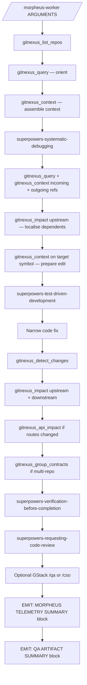

## Summary — order of operations

1. Use **GitNexus first** to orient in the repo, route the investigation, and narrow the blast radius.
2. Use **Superpowers `/systematic-debugging`** to reproduce and identify root cause before changing code.
3. Use **Superpowers `/test-driven-development`** to add or tighten a failing regression test.
4. Implement the **narrowest fix** consistent with the GitNexus graph and the failing test.
5. Run **GitNexus post-fix diagnostics**:
   - `gitnexus_detect_changes`
   - `gitnexus_impact` upstream (who called the changed symbol)
   - `gitnexus_impact` downstream (what this symbol depends on)
   - `gitnexus_api_impact` (if HTTP routes or API surfaces changed)
   - `gitnexus_group_contracts` (if multi-repo groups are configured)
6. Use **Superpowers `/verification-before-completion`** for fresh verification.
7. Use **Superpowers `/requesting-code-review`** for review.
8. Use **GStack `/qa`** only if UI/frontend changed; **GStack `/cso`** only if auth/security surface changed.
9. If the bug escalates to GSD (multi-phase), invoke `Skill("morpheus-integration-gate")` after all phases integrate and before the comprehensive PR.

**Mandatory Superpowers invocations (use `Skill` tool — not inline emulation):**

| When | Skill to invoke |
|---|---|
| Before any code change | `Skill("superpowers-systematic-debugging")` |
| Before writing the fix | `Skill("superpowers-test-driven-development")` |
| After fix + diagnostics | `Skill("superpowers-verification-before-completion")` |
| Before declaring done | `Skill("superpowers-requesting-code-review")` |
| GSD path: after all phases integrate | `Skill("morpheus-integration-gate")` |

If a Superpowers skill is not installed, **stop and report** — do not proceed with the fix until the skill is available or the user explicitly opts out.

---

## Worker preamble contract

Before any source reading, code editing, or test-writing, enforce this contract in order:

**Step 0 — Pre-flight: verify `.mcp.json` has a `gitnexus` entry**

```bash
cat .mcp.json 2>/dev/null | python3 -c "import json,sys; d=json.load(sys.stdin); print('ok' if 'gitnexus' in d.get('mcpServers',{}) else 'missing')" 2>/dev/null || echo "missing"
```

- If the result is `missing`: **STOP immediately.** Print this message and wait for the user to fix it:

  ```
  ✗ GitNexus MCP is not configured in .mcp.json.

  Add this to your .mcp.json (create the file if it does not exist):

  {
    "mcpServers": {
      "gitnexus": {
        "command": "npx",
        "args": ["-y", "gitnexus@latest", "mcp"]
      }
    }
  }

  Then re-run: npx gitnexus analyze
  Then restart Claude Code so the MCP server is approved and connected.
  Then re-invoke this skill.
  ```

- If the result is `ok`: continue to step 1.

**Do not proceed to degraded mode when the fix is a missing config file.** Degraded mode is only for when `.mcp.json` is correct but the server is transiently unavailable.

1. Call `gitnexus_list_repos()` — verify the index is non-empty. If empty, run `npx gitnexus analyze` and re-check before continuing.
2. Call `gitnexus_query({query: "<bug summary>"})` — broad orientation, find candidate symbols.
3. Call `gitnexus_context({name: "<top candidate>"})` — assemble relevant context bundle.
4. Use GitNexus tools to localise the likely root-cause area.
5. Before editing each target file, call `gitnexus_context` on the target symbol.
6. Prefer `gitnexus_query` + `gitnexus_context` over whole-file reads.
7. Only fall back to `Read`, `Grep`, or `Glob` when `.mcp.json` is correct but the server is transiently unavailable.

---

## Primary tools

### GitNexus MCP tools (use in this order)

- `gitnexus_list_repos` — orient: verify index is non-empty
- `gitnexus_query` — hybrid BM25 + semantic search; replaces `search_symbols` and `get_repo_outline`
- `gitnexus_context` — 360-degree symbol view (callers + callees + process participation)
- `gitnexus_impact` with `direction: "upstream"` — who depends on this symbol
- `gitnexus_impact` with `direction: "downstream"` — what this symbol depends on
- `gitnexus_detect_changes` — git-diff impact; maps changed lines to affected processes
- `gitnexus_api_impact` — blast radius for HTTP route or API surface changes
- `gitnexus_rename` — coordinated multi-file rename
- `gitnexus_group_contracts` — cross-repo contract check
- `gitnexus_cypher` — raw Cypher graph query for complex multi-hop traces

### Superpowers skills

- `/systematic-debugging`
- `/test-driven-development`
- `/verification-before-completion`
- `/requesting-code-review`

### Optional GStack

- `/qa` — browser/UI validation (only if UI changed)
- `/cso` — security audit (only if auth/security surface changed)

### Fallback rule

If a **GitNexus MCP tool** is unavailable (server transiently down, not config missing):
- continue in degraded mode using `Read` / `Grep` / `Glob`
- state explicitly that GitNexus is unavailable

If a **Superpowers skill** is unavailable:
- **stop** — do not emulate inline
- tell the user which skill is missing and ask them to install it or explicitly opt out

---

## Main fix loop

| Stage | Required action | Output needed before continuing |
|---|---|---|
| Orient | `gitnexus_list_repos()` | non-empty index confirmed |
| Assemble context | `gitnexus_query({query: "<bug area>"})` | candidate symbols |
| Reproduce | `Skill("superpowers-systematic-debugging")` | exact bug reproduction or smallest failing case |
| Localise | `gitnexus_query`, `gitnexus_context` (incoming + outgoing refs), `gitnexus_impact(upstream)` | root-cause candidate with evidence |
| Prepare edit | `gitnexus_context({name: "<target symbol>"})` | callers, deps, process participation |
| Lock regression | `Skill("superpowers-test-driven-development")` | failing regression test + `suite_before_fix` captured in `.morpheus-qa.json` |
| Fix | narrow code change only | test now passes locally; `tests_modified` updated in `.morpheus-qa.json` |
| Diagnose change | `gitnexus_detect_changes({scope: "staged"})` | changed symbols + affected processes |
| Verify impact | `gitnexus_impact(upstream)` + `gitnexus_impact(downstream)` | blast radius confirmed |
| API check | `gitnexus_api_impact` (if routes changed) | route consumers identified |
| Contract check | `gitnexus_group_contracts` (if multi-repo) | cross-repo breakage ruled out |
| Verify | `Skill("superpowers-verification-before-completion")` | fresh green evidence + `suite_after_fix` + coverage captured in `.morpheus-qa.json` |
| Review | `Skill("superpowers-requesting-code-review")` | review findings and follow-up actions |
| **Emit summaries** | **MANDATORY** | print MORPHEUS TELEMETRY SUMMARY block, then QA ARTIFACT SUMMARY block |

**QA artifact checkpoints** — update `.morpheus-qa.json` at these specific stages:

| Stage | What to write |
|---|---|
| Lock regression | `regression_test` (file, name, framework), `tests_added` list, `suite_before_fix` (total/pass/fail/skip) |
| Fix | `tests_modified` list (any existing tests tightened) |
| Verify | `suite_after_fix` (total/pass/fail/skip/duration), `coverage` delta if tool available |
| Review | `ui_qa` result (invoked or skipped + reason), `security_qa` result (invoked or skipped + reason) |

### Workflow diagram



---

## Hooks

Assume the preferred state is that `npx gitnexus analyze` has already registered repo-local hooks for:

- `PreToolUse` (denies raw `Read`/`Grep`/`Glob` on indexed source)
- `PreCompact`
- `Stop`

Required behaviour even if the hooks are missing:
- self-enforce the read/grep rule
- self-enforce post-fix diagnostics
- self-enforce stop gating before claiming completion

Optional stop-gate policy — refuse to stop if:
- there is no reproduction
- there is no failing or formerly failing test
- post-fix GitNexus diagnostics have not run
- verification has not been run fresh
- review has not been requested
- or a required worktree hand-off is missing

---

## Telemetry

### What is tracked

| Dimension | What | How |
|---|---|---|
| **Wall-clock time** | Duration of each stage in milliseconds | `date +%s%3N` at start and end of each stage |
| **Token consumption** | Input, output, and cache tokens per stage | Parsed from `--output-format stream-json` in headless mode; self-reported JSON markers in interactive mode |
| **OTEL spans** | One root span per bug, one child span per stage | `otel-cli span create` — requires `otel-cli` to be installed |

### Timing

At the **start of each stage**, record the stage name and millisecond epoch:

```bash
STAGE_NAME="orient"
STAGE_START_MS=$(date +%s%3N)
```

At the **end of each stage**, compute duration and write to the telemetry state file:

```bash
STAGE_END_MS=$(date +%s%3N)
STAGE_DURATION_MS=$((STAGE_END_MS - STAGE_START_MS))
jq --arg stage "$STAGE_NAME" \
   --argjson start "$STAGE_START_MS" \
   --argjson end "$STAGE_END_MS" \
   --argjson dur  "$STAGE_DURATION_MS" \
   '.stages[$stage] |= . + {start_ms: $start, end_ms: $end, duration_ms: $dur}' \
   .morpheus-telemetry.json > .morpheus-telemetry.tmp.json \
   && mv .morpheus-telemetry.tmp.json .morpheus-telemetry.json
```

Apply this pattern to every stage: **Orient, Assemble context, Reproduce, Localise, Prepare edit, Lock regression, Fix, Diagnose change, Verify impact, API check, Contract check, Verify, Review**.

### Token tracking

**Headless mode** — run with `--output-format stream-json`:

```bash
claude --output-format stream-json -p '/morpheus-fix-bug-using-gitnexus KAN-229' \
  | tee session-raw.ndjson
```

Each `usage` event:

```json
{
  "type": "usage",
  "input_tokens": 12400,
  "output_tokens": 2100,
  "cache_read_input_tokens": 9800,
  "cache_creation_input_tokens": 600
}
```

Accumulate delta usage across events to attribute tokens to the active stage. Store per-stage sums in `.morpheus-telemetry.json`.

**Interactive mode** — after each stage, emit:

```json
{"morpheus_telemetry": true, "stage": "<stage-name>", "tokens": {"input": 0, "output": 0, "cache_read": 0, "cache_write": 0}}
```

### OpenTelemetry

Check availability at session start:

```bash
OTEL_ENABLED=$(which otel-cli >/dev/null 2>&1 && echo "true" || echo "false")
```

Configure the exporter:

```bash
export OTEL_EXPORTER_OTLP_ENDPOINT="${OTEL_EXPORTER_OTLP_ENDPOINT:-http://localhost:4317}"
export OTEL_SERVICE_NAME="morpheus-bug-fixer"
```

Root span at session start:

```bash
TRACEPARENT_FILE=".morpheus-traceparent"
if [ "$OTEL_ENABLED" = "true" ]; then
  otel-cli span background \
    --service "morpheus-bug-fixer" \
    --name "bug-fix/<issue-id>" \
    --attrs "bug.id=<issue-id>,bug.source=<jira|cli|stack_trace|test|text>,git.branch=$(git rev-parse --abbrev-ref HEAD)" \
    --tp-print \
    --tp-carrier "$TRACEPARENT_FILE"
fi
```

Per-stage child span:

```bash
if [ "$OTEL_ENABLED" = "true" ]; then
  otel-cli span create \
    --service "morpheus-bug-fixer" \
    --name "stage/$STAGE_NAME" \
    --tp-required \
    --tp-carrier "$TRACEPARENT_FILE" \
    --attrs "stage.duration_ms=$STAGE_DURATION_MS,stage.tokens_in=$TOKENS_IN,stage.tokens_out=$TOKENS_OUT,stage.cache_read=$TOKENS_CACHE_READ,stage.cache_write=$TOKENS_CACHE_WRITE"
fi
```

**Span attribute conventions:**

| Attribute | Value |
|---|---|
| `bug.id` | Jira/GitHub issue key |
| `bug.source` | `jira`, `cli`, `stack_trace`, `test`, `text` |
| `stage.name` | stage name from the fix loop |
| `stage.duration_ms` | integer milliseconds |
| `stage.tokens_in` | input tokens for this stage |
| `stage.tokens_out` | output tokens for this stage |
| `stage.cache_read` | cache-read tokens for this stage |
| `stage.cache_write` | cache-write tokens for this stage |
| `fix.result` | `fixed`, `failed`, `blocked`, `skipped` |
| `git.branch` | current branch |
| `gitnexus.repos_indexed` | repo count from `gitnexus_list_repos` |

If `otel-cli` is not installed, skip span creation silently.

### Telemetry state file

Initialise `.morpheus-telemetry.json` at session start:

```json
{
  "schema_version": "1",
  "bug_id": "<issue-id>",
  "trace_id": null,
  "session_start_ms": 0,
  "stages": {},
  "totals": {}
}
```

### Telemetry summary block

Print before the Stop hook runs:

```
╔════════════════════════════════════════════════════════════════════════════╗
║               MORPHEUS TELEMETRY SUMMARY — JIRA-101                       ║
╠═══════════════════════╦══════════════╦═══════════════════════════════════╣
║ Stage                 ║ Duration     ║ Tokens (in / out / cache)         ║
╠═══════════════════════╬══════════════╬═══════════════════════════════════╣
║ Orient                ║  1,234 ms    ║   2,100 /   340 /  1,500          ║
║ Assemble context      ║  2,890 ms    ║   5,400 /   620 /  4,200          ║
║ Reproduce             ║ 45,210 ms    ║  18,200 / 3,400 / 12,100          ║
║ Localise              ║  8,320 ms    ║   7,800 / 1,200 /  6,400          ║
║ Prepare edit          ║  3,100 ms    ║   4,200 /   580 /  3,800          ║
║ Lock regression       ║ 32,450 ms    ║  14,300 / 2,800 / 11,200          ║
║ Fix                   ║  6,780 ms    ║   3,400 /   920 /  2,800          ║
║ Diagnose change       ║  2,100 ms    ║   2,800 /   440 /  2,400          ║
║ Verify impact         ║  4,560 ms    ║   4,100 /   680 /  3,600          ║
║ API check             ║  1,890 ms    ║   2,200 /   380 /  1,900          ║
║ Contract check        ║    890 ms    ║   1,100 /   220 /    900          ║
║ Verify                ║ 28,340 ms    ║  12,400 / 2,100 /  9,800          ║
║ Review                ║ 19,670 ms    ║   9,600 / 1,800 /  7,200          ║
╠═══════════════════════╬══════════════╬═══════════════════════════════════╣
║ TOTAL                 ║ 157,434 ms   ║  87,600 / 15,480 / 67,800         ║
║                       ║  (2m 37s)    ║  Combined total: 170,880 tokens   ║
╠═══════════════════════╩══════════════╩═══════════════════════════════════╣
║ OTEL Trace ID: 4bf92f3577b34da6a3ce929d0e0e4736                          ║
║ Trace URL:     http://localhost:16686/trace/4bf92f3577b34da6a3ce929d0e0e4736 ║
╚════════════════════════════════════════════════════════════════════════════╝
```

Omit the OTEL rows if OTEL is not configured.

---

## QA Artifacts

### QA state file

Initialise `.morpheus-qa.json` at session start:

```json
{
  "schema_version": "1",
  "bug_id": "<issue-id>",
  "regression_test": null,
  "tests_added": [],
  "tests_modified": [],
  "suite_before_fix": null,
  "suite_after_fix": null,
  "coverage": null,
  "ui_qa": null,
  "security_qa": null
}
```

### Recording at each QA stage

#### At "Lock regression" (`superpowers-test-driven-development`)

```bash
jq '.regression_test = {
      "file": "tests/auth/test_login.py",
      "test_name": "test_mfa_login_500_regression",
      "framework": "pytest",
      "was_failing_before_fix": true
    } |
    .tests_added = [{
      "file": "tests/auth/test_login.py",
      "test_name": "test_mfa_login_500_regression",
      "type": "regression"
    }]' .morpheus-qa.json > .morpheus-qa.tmp.json && mv .morpheus-qa.tmp.json .morpheus-qa.json

# Run full suite and capture baseline (adapt to project's test runner):
# Python: pytest --tb=no -q 2>&1 | tail -1
# JS/TS:  npx jest --passWithNoTests --json 2>/dev/null | jq '{total:.numTotalTests,...}'
# Go:     go test ./... -v 2>&1 | grep -E "^(ok|FAIL|---)"
# Java:   mvn test -q 2>&1 | grep -E "Tests run:"
# C#:     dotnet test --no-build 2>&1

jq '.suite_before_fix = {"total": 0, "passed": 0, "failed": 0, "skipped": 0, "duration_ms": 0, "command": "<test command>"}' \
   .morpheus-qa.json > .morpheus-qa.tmp.json && mv .morpheus-qa.tmp.json .morpheus-qa.json
```

**Do not proceed to the Fix stage if `suite_before_fix` is null.**

#### At "Fix" (after narrow code change)

```bash
jq '.tests_modified = [{"file": "<path>", "test_name": "<name>", "change": "<why it changed>"}]' \
   .morpheus-qa.json > .morpheus-qa.tmp.json && mv .morpheus-qa.tmp.json .morpheus-qa.json
```

If no existing tests changed, leave `tests_modified` as `[]`.

#### At "Verify" (`superpowers-verification-before-completion`)

```bash
jq '.suite_after_fix = {"total": 0, "passed": 0, "failed": 0, "skipped": 0, "duration_ms": 0}' \
   .morpheus-qa.json > .morpheus-qa.tmp.json && mv .morpheus-qa.tmp.json .morpheus-qa.json

# Coverage delta (adapt to tooling):
# Python:  pytest --cov=. --cov-report=json -q
# JS:      npx jest --coverage --coverageReporters=json-summary
# Go:      go test ./... -coverprofile=coverage.out && go tool cover -func=coverage.out
# C#:      dotnet test --collect:"XPlat Code Coverage"

jq --arg before "0" --arg after "$AFTER_PCT" \
   '.coverage = {"before_pct": ($before | tonumber), "after_pct": ($after | tonumber),
                 "delta_pct": (($after | tonumber) - ($before | tonumber))}' \
   .morpheus-qa.json > .morpheus-qa.tmp.json && mv .morpheus-qa.tmp.json .morpheus-qa.json
```

#### After GStack `/qa` (UI QA — optional, only if UI changed)

```bash
jq '.ui_qa = {
      "invoked": true,
      "result": "pass",
      "scenarios_tested": ["<scenario 1>"],
      "screenshots": ["qa/screenshots/<name>.png"]
    }' .morpheus-qa.json > .morpheus-qa.tmp.json && mv .morpheus-qa.tmp.json .morpheus-qa.json
# If not invoked: {"invoked": false, "reason": "no UI changes in this fix"}
```

#### After GStack `/cso` (security review — optional, only if auth/security surface changed)

```bash
jq '.security_qa = {"invoked": true, "result": "pass", "findings": []}' \
   .morpheus-qa.json > .morpheus-qa.tmp.json && mv .morpheus-qa.tmp.json .morpheus-qa.json
# If not invoked: {"invoked": false, "reason": "no auth/security surface changed"}
```

### QA summary block

Print after the telemetry summary and before the Stop hook:

```
╔══════════════════════════════════════════════════════════════════╗
║                QA ARTIFACT SUMMARY — JIRA-101                   ║
╠══════════════════════════════════════════════════════════════════╣
║ Regression test                                                  ║
║   File:       tests/auth/test_login.py                          ║
║   Test name:  test_mfa_login_500_regression                     ║
║   Framework:  pytest                                             ║
╠═══════════════════════╦══════════════════════════════════════════╣
║ Test cases             ║ Added: 1   Modified: 0   Deleted: 0    ║
╠═══════════╦════════════╬══════════════════╦═══════════════════════╣
║ Suite     ║ Before fix ║ After fix        ║ Delta                ║
╠═══════════╬════════════╬══════════════════╬═══════════════════════╣
║ Total     ║ 142        ║ 143              ║ +1                   ║
║ Passed    ║ 141        ║ 143              ║ +2                   ║
║ Failed    ║   1        ║   0              ║ -1  ✓                ║
║ Skipped   ║   2        ║   2              ║  0                   ║
║ Duration  ║ 14.2 s     ║ 14.8 s           ║ +0.6 s               ║
╠═══════════╬════════════╬══════════════════╬═══════════════════════╣
║ Coverage  ║ 78.4%      ║ 79.1%            ║ +0.7%                ║
╠═══════════╩════════════╩══════════════════╩═══════════════════════╣
║ UI QA:        not invoked — no UI changes in this fix            ║
║ Security QA:  not invoked — no auth surface changes              ║
╚══════════════════════════════════════════════════════════════════╝
```

Rendering rules:
- If `suite_before_fix` is null → print `baseline not captured` and block at Stop hook.
- If `coverage` is null → omit the Coverage row entirely.
- If `failed` delta is 0 or positive → flag with `⚠ regression` and Stop hook must block.
- If `ui_qa.invoked` is false → print `not invoked — <reason>`.

### QA non-negotiable rules

- Do **not** proceed past Lock regression without capturing `suite_before_fix`.
- Do **not** declare done if `suite_after_fix.failed >= suite_before_fix.failed`.
- Do **not** skip the QA summary block.
- The regression test file and name must be in `.morpheus-qa.json` before the Stop hook runs.

---

## Escalation to GSD

Do **not** use GSD by default. Escalate only when:

- the bug spans multiple services or repositories,
- the investigation repeatedly loses context,
- the investigation requires several independent debug phases,
- a single session is no longer keeping a coherent root-cause thread,
- or the worker prompt explicitly requests `/gsd-debug`.

When escalating: preserve the current bug brief, evidence, root-cause hypothesis, and changed symbols. Start each new phase with the same GitNexus context contract.

**After all GSD phases complete and branches are integrated**, invoke `Skill("morpheus-integration-gate")` before creating the comprehensive PR. Do not skip — see `morpheus-integration-gate` for the full protocol.

---

## RalphLoop and headless worktree notes

- Work only inside the assigned git worktree.
- Do not modify the main worktree directly.
- Do not rewrite orchestrator files unless the worker prompt explicitly assigns them.
- If a HUMAN GATE or equivalent stop condition triggers, halt and report.
- If the repo needs `.env` or other gitignored local files in worktrees, use `.worktreeinclude`.
- Do **not** run this skill in `claude -p --bare` mode — project skills, hooks, `.mcp.json`, and `CLAUDE.md` will not load.

---

## Example interactive transcript

```text
User: /morpheus-fix-bug-using-gitnexus "500 on POST /auth/login when MFA is enabled"
Assistant:
- Call gitnexus_list_repos to verify index
- Call gitnexus_query with "auth login MFA 500"
- Call gitnexus_context on the top candidate symbol
- Invoke superpowers-systematic-debugging
- Reproduce failure locally
- Call gitnexus_context on target files/symbols
- Invoke superpowers-test-driven-development
- Add failing regression test
- Fix the smallest set of symbols needed
- Call gitnexus_detect_changes
- Call gitnexus_impact upstream + downstream
- Call gitnexus_api_impact (route changed)
- Invoke superpowers-verification-before-completion
- Invoke superpowers-requesting-code-review
- If UI flow changed, invoke GStack /qa
- If auth surface changed, invoke GStack /cso
- Print MORPHEUS TELEMETRY SUMMARY block
- Print QA ARTIFACT SUMMARY block
```
