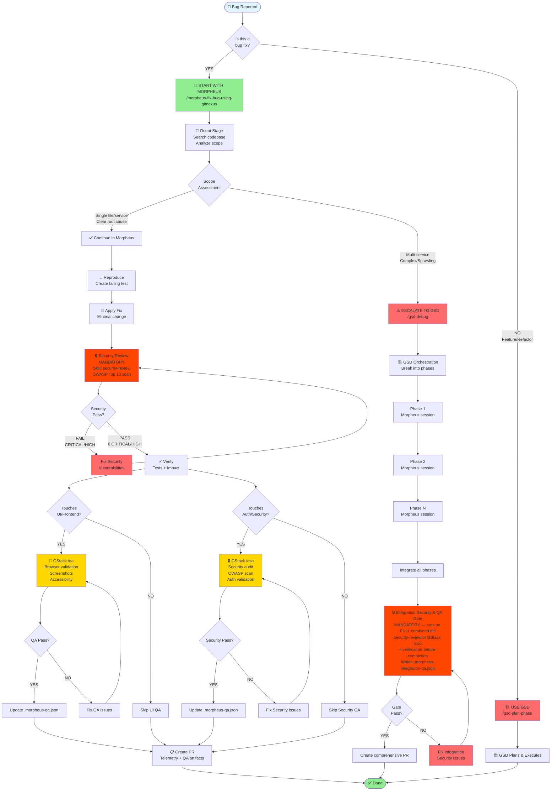
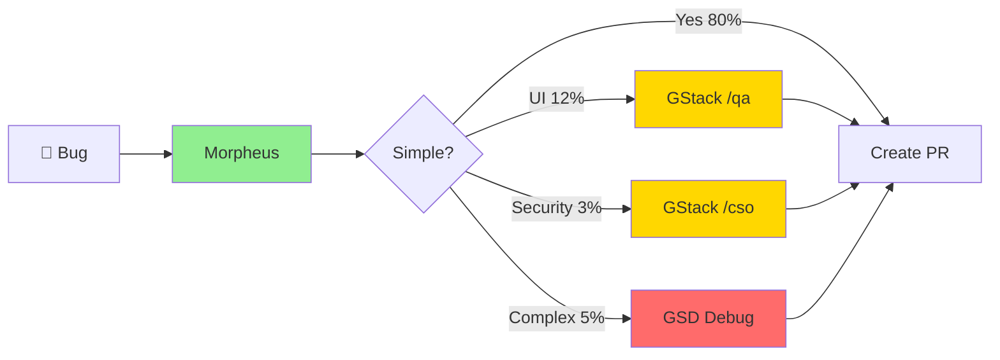
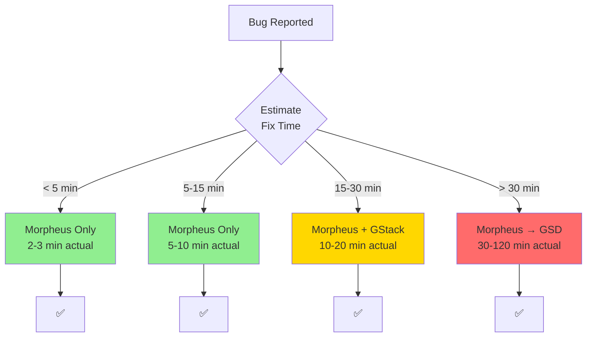
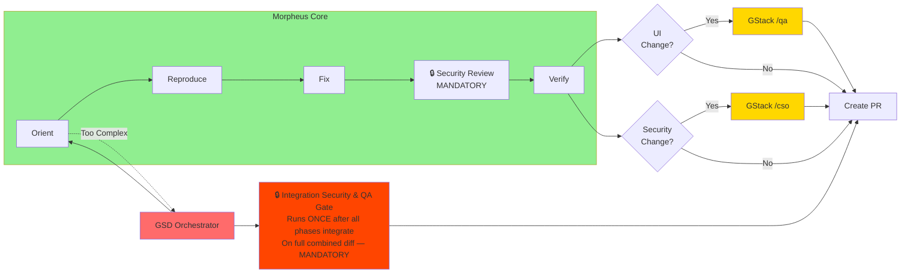
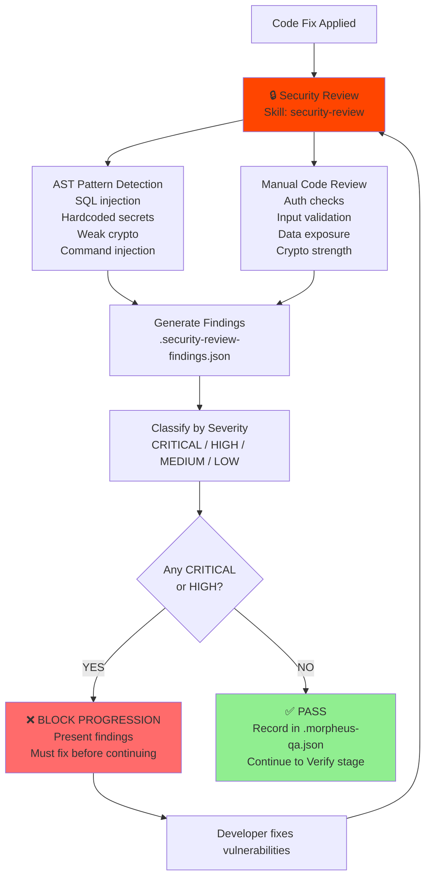

# Morpheus Bug Fix Workflow - Visual Flowchart

> **🔒 Security Note**: As of 2026-05-23, all bug fixes now include a **mandatory security review** stage after the Fix step. The `security-review` skill scans for OWASP Top 10 vulnerabilities and blocks PR creation if CRITICAL or HIGH findings are detected.

## Main Decision Flow



---

## Simplified Flow (For Quick Reference)



---

## Workflow by Bug Type

```mermaid
flowchart TD
    subgraph Backend["Backend Bug (80%)"]
        B1[Morpheus Orient] --> B2[Reproduce]
        B2 --> B3[Fix]
        B3 --> B3a[🔒 Security Review<br/>MANDATORY]
        B3a --> B4[Verify]
        B4 --> B5[PR]
    end
    
    subgraph Frontend["Frontend Bug (12%)"]
        F1[Morpheus Orient] --> F2[Reproduce]
        F2 --> F3[Fix]
        F3 --> F3a[🔒 Security Review<br/>MANDATORY]
        F3a --> F4[Verify]
        F4 --> F5[GStack /qa]
        F5 --> F6[PR]
    end
    
    subgraph Security["Security Bug (3%)"]
        S1[Morpheus Orient] --> S2[Reproduce]
        S2 --> S3[Fix]
        S3 --> S3a[🔒 Security Review<br/>MANDATORY]
        S3a --> S4[Verify]
        S4 --> S5[GStack /cso]
        S5 --> S6[PR]
    end
    
    subgraph Complex["Complex Bug (5%)"]
        C1[Morpheus Orient] --> C2[Escalate]
        C2 --> C3[GSD Phase 1]
        C3 --> C4[GSD Phase 2]
        C4 --> C5[GSD Phase N]
        C5 --> C5a[🔒 Integration Security & QA Gate<br/>Full combined diff — MANDATORY<br/>.morpheus-integration-qa.json]
        C5a --> C6[PR]
    end
    
    style Backend fill:#90EE90
    style Frontend fill:#FFD700
    style Security fill:#FF6347
    style Complex fill:#FF6B6B
```



---

## Time-Based Decision



---

## Integration Points



---

## Security Review Stage Details

**What happens in the Security Review stage?**



**Key Points:**
- **Mandatory**: Runs after every fix, no exceptions
- **Blocking**: CRITICAL or HIGH findings prevent PR creation
- **OWASP Top 10**: Covers all major vulnerability categories
- **Structured Output**: JSON findings with severity, CWE, OWASP mapping, remediation
- **Integration**: Results recorded in `.morpheus-qa.json` and displayed in QA summary

---

## How to Use These Diagrams

### In GitHub / GitLab / Bitbucket
These platforms support Mermaid natively. Just paste the code block with the ` ```mermaid ` tag.

### In Confluence
1. Install the "Mermaid Diagrams for Confluence" plugin
2. Insert a Mermaid macro
3. Paste the diagram code

### In VS Code
1. Install the "Markdown Preview Mermaid Support" extension
2. Open this file in preview mode (Ctrl/Cmd + Shift + V)

### In Notion
1. Create a code block
2. Select "Mermaid" as the language
3. Paste the diagram code

### In Slack/Teams
Use a screenshot of the rendered diagram (GitHub renders it, take a screenshot)

### Online Renderer
Visit https://mermaid.live/ and paste any diagram to see it rendered and export as PNG/SVG

---

## Quick Copy-Paste Versions

### Version 1: Full Decision Tree (Use this for documentation)
Copy lines 5-66 from this file

### Version 2: Simplified (Use this for presentations)
Copy lines 70-84 from this file

### Version 3: By Bug Type (Use this for training)
Copy lines 88-116 from this file

### Version 4: Time-Based (Use this for planning)
Copy lines 120-137 from this file

### Version 5: Integration Points (Use this for architecture docs)
Copy lines 141-165 from this file
